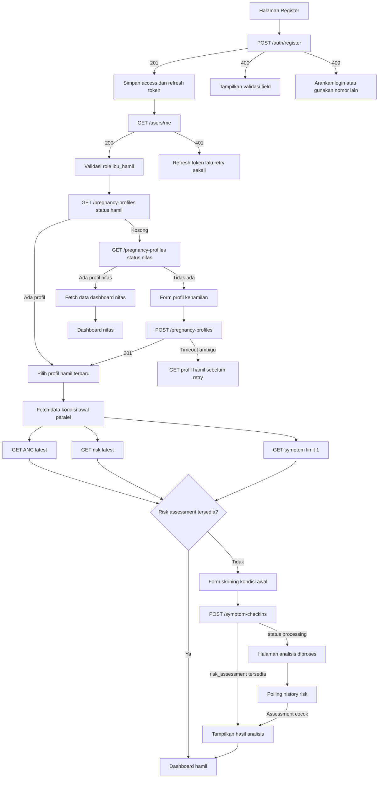

# Alur Mobile: Register, Analisis Kondisi Awal, dan Navigasi Dashboard

Dokumen ini menjelaskan alur aplikasi mobile untuk pengguna role `ibu_hamil`, mulai register sampai dashboard siap ditampilkan.

## 1. Ringkasan Kontrak Backend

Hal penting sebelum implementasi:

1. `POST /auth/register` hanya membuat user dan token.
2. Register **tidak** membuat profil kehamilan.
3. `POST /pregnancy-profiles` membuat profil kehamilan dan reminder ANC awal.
4. Pembuatan profil **tidak** menjalankan analisis AI.
5. Analisis risiko kehamilan dipicu oleh `POST /symptom-checkins`.
6. ANC terbaru menjadi input tambahan AI, tetapi `POST /anc-records` sendiri tidak memicu AI.
7. Tidak ada endpoint agregat dashboard ibu. Mobile perlu beberapa request paralel.
8. Hasil terbaru yang belum ada dikembalikan sebagai `200` dengan `data: null`, bukan `404`.

## 2. State Onboarding Mobile

FE disarankan menyimpan state berikut:

```dart
enum InitialFlowState {
  unauthenticated,
  checkingSession,
  loadingUser,
  loadingPregnancyProfile,
  pregnancyProfileRequired,
  initialScreeningRequired,
  analyzingCondition,
  pregnancyDashboard,
  postpartumDashboard,
  noActivePregnancy,
  error,
}
```

Data session minimum:

```dart
class AuthSession {
  final String accessToken;
  final String refreshToken;
  final int expiresIn;
}
```

Data flow minimum:

```dart
class InitialFlowContext {
  final UserModel user;
  final PregnancyProfileModel? profile;
  final AncRecordModel? latestAnc;
  final SymptomCheckinModel? latestCheckin;
  final RiskAssessmentModel? latestRisk;
}
```

## 3. Diagram Alur Utama



## 4. Tahap 1 — Register

### Endpoint

```http
POST /auth/register
Content-Type: application/json
```

### Body ibu hamil

```json
{
  "full_name": "Siti Aminah",
  "phone_number": "081234567890",
  "password": "password123",
  "email": "siti@example.com"
}
```

Aturan FE:

- Pakai nama field snake_case.
- Nomor menerima `08...`, `628...`, atau `+628...`; backend menyimpan `+628...`.
- Password minimal 8 karakter.
- Jangan kirim `email: ""`; hapus field jika kosong.
- Role tidak dipilih dan tidak dikirim FE. Backend menetapkan `ibu_hamil`.
- Jangan kirim `role` atau `puskesmas_id`; keduanya ditolak sebagai field asing.
- Jangan kirim field UI seperti `confirm_password`, `terms_accepted`, atau `date_of_birth` karena field asing ditolak.

### Respons sukses

```json
{
  "status_code": 201,
  "message": "success",
  "data": {
    "user": {
      "id": "<user_uuid>",
      "full_name": "Siti Aminah",
      "phone_number": "+6281234567890",
      "role": "ibu_hamil"
    },
    "access_token": "<jwt>",
    "refresh_token": "<opaque_token>",
    "expires_in": 900
  }
}
```

### Aksi FE setelah sukses

1. Simpan `access_token` dan `refresh_token` dalam secure storage.
2. Simpan waktu kedaluwarsa lokal berdasarkan `expires_in`.
3. Jangan langsung navigate ke dashboard.
4. Masuk ke route loading, misalnya `/initializing`.
5. Jalankan bootstrap user dan profil.

Contoh:

```dart
final response = await dio.post('/auth/register', data: payload);
final authData = response.data['data'] as Map<String, dynamic>;

await secureStorage.write(
  key: 'access_token',
  value: authData['access_token'] as String,
);
await secureStorage.write(
  key: 'refresh_token',
  value: authData['refresh_token'] as String,
);

router.go('/initializing');
```

### Error

| Status | Tindakan FE |
|---|---|
| `400` | Tampilkan isi `message` pada form |
| `409` | Nomor sudah terdaftar; tawarkan login |
| `5xx`/timeout | Jangan anggap register gagal; coba login dengan credential sama atau cek ulang secara aman |

## 5. Tahap 2 — Konfirmasi User Login

### Endpoint

```http
GET /users/me
Authorization: Bearer <access_token>
```

Tujuan:

- memastikan token valid;
- mengambil profil user terbaru dari server;
- memastikan role `ibu_hamil`;
- tidak bergantung pada object user dari response register saja.

### Keputusan

| Kondisi | Navigasi/aksi |
|---|---|
| `200`, role `ibu_hamil` | Lanjut cek profil kehamilan |
| `401` | Refresh token lalu retry satu kali |
| Refresh gagal | Hapus session, navigate `/login` |
| Role bukan `ibu_hamil` | Arahkan dashboard sesuai role atau blok alur ini |

## 6. Tahap 3 — Mencari Profil Aktif

### Cari profil hamil

```http
GET /pregnancy-profiles?status=hamil&limit=20&offset=0
Authorization: Bearer <access_token>
```

Bentuk respons:

```json
{
  "status_code": 200,
  "message": "success",
  "data": {
    "data": [],
    "total": 0
  }
}
```

Perhatikan dua lapis `data`:

```dart
final envelope = response.data as Map<String, dynamic>;
final page = envelope['data'] as Map<String, dynamic>;
final rows = page['data'] as List<dynamic>;
```

### Decision table profil

| Profil `hamil` | Profil `nifas` | Hasil |
|---|---|---|
| Ada | Tidak perlu dicek | Lanjut bootstrap dashboard hamil |
| Kosong | Ada | Navigate dashboard nifas |
| Kosong | Kosong | Navigate form profil kehamilan |
| Lebih dari satu | — | Pakai item pertama karena urutan terbaru; log sebagai anomali |

Jika profil hamil kosong, cek profil nifas:

```http
GET /pregnancy-profiles?status=nifas&limit=20&offset=0
```

Jangan otomatis membuat profil baru sebelum pemeriksaan nifas selesai. User mungkin baru melahirkan dan harus masuk dashboard nifas.

## 7. Tahap 4 — Membuat Profil Kehamilan

Tampilkan form minimum:

- HPHT
- gravida/kehamilan keberapa
- kondisi bawaan atau riwayat penyakit
- riwayat preeklampsia

### Endpoint

```http
POST /pregnancy-profiles
Authorization: Bearer <access_token>
Content-Type: application/json
```

### Body minimum

```json
{
  "hpht": "2026-07-01",
  "gravida": 1
}
```

### Body lengkap

```json
{
  "hpht": "2026-07-01",
  "gravida": 1,
  "existing_conditions": ["hipertensi"],
  "had_preeclampsia_history": false
}
```

Aturan:

- `hpht`: `YYYY-MM-DD`.
- `gravida`: integer minimal 1.
- `existing_conditions`: array string, opsional.
- `had_preeclampsia_history`: boolean, opsional.
- Untuk ibu hamil, jangan kirim `user_id`; backend memakai user dari JWT.

### Efek backend

Backend akan:

1. menghitung HPL dari HPHT + 280 hari;
2. membuat profil dengan status `hamil`;
3. membuat reminder ANC awal.

Backend belum menjalankan analisis AI pada tahap ini.

### Penting: retry profil

Pembuatan profil belum idempoten. Jika POST timeout setelah server mungkin berhasil:

1. Jangan langsung mengulang POST.
2. Jalankan `GET /pregnancy-profiles?status=hamil`.
3. Jika profil sudah muncul, gunakan profil tersebut.
4. Hanya ulang POST jika hasil GET tetap kosong.

Setelah sukses, simpan `pregnancy_profile_id` dan lanjut bootstrap kondisi awal.

## 8. Tahap 5 — Bootstrap Kondisi Awal

Setelah memperoleh profil `hamil`, jalankan tiga request secara paralel.

### Request A: ANC terbaru

```http
GET /anc-records/latest?pregnancy_profile_id=<profile_uuid>
```

Hasil:

- `data` berisi ANC terbaru; atau
- `data: null` jika belum pernah ada ANC.

### Request B: risk assessment terbaru

```http
GET /risk-assessments/latest?pregnancy_profile_id=<profile_uuid>
```

Hasil:

- `data` berisi assessment terbaru; atau
- `data: null` jika belum pernah dianalisis.

### Request C: symptom check-in terbaru

```http
GET /symptom-checkins?pregnancy_profile_id=<profile_uuid>&limit=1&offset=0
```

Hasil list terbaru:

```json
{
  "status_code": 200,
  "message": "success",
  "data": {
    "data": [],
    "total": 0
  }
}
```

### Contoh parallel fetch

```dart
final results = await Future.wait([
  dio.get(
    '/anc-records/latest',
    queryParameters: {'pregnancy_profile_id': profileId},
  ),
  dio.get(
    '/risk-assessments/latest',
    queryParameters: {'pregnancy_profile_id': profileId},
  ),
  dio.get(
    '/symptom-checkins',
    queryParameters: {
      'pregnancy_profile_id': profileId,
      'limit': 1,
      'offset': 0,
    },
  ),
]);
```

### Keputusan setelah fetch

| Kondisi | Tindakan |
|---|---|
| Risk assessment tersedia | Navigate dashboard hamil |
| Risk kosong dan symptom kosong | Navigate skrining kondisi awal |
| Risk kosong tetapi symptom ada | Assessment mungkin diproses; cek history/polling |
| ANC kosong | Tetap boleh skrining; AI menerima `latest_anc: null` |
| Salah satu GET gagal non-auth | Tampilkan retry; jangan membuat data baru otomatis |

## 9. Tahap 6 — Form Skrining Kondisi Awal

Skrining awal menggunakan endpoint symptom check-in. Endpoint ini sekaligus memicu analisis risiko AI.

### Data yang perlu disiapkan FE

- `pregnancy_profile_id`
- jawaban gejala
- `client_uuid` stabil
- `X-Request-Id` untuk tracing

`answers` divalidasi backend sebagai object, tetapi nama key gejala tidak divalidasi secara rinci. FE harus memakai key yang disepakati, misalnya:

```json
{
  "sakit_kepala": "berat",
  "pandangan_kabur": true,
  "bengkak_kaki": true,
  "mudah_lelah": false,
  "pusing": "tidak"
}
```

Jangan mengubah nama key antarversi tanpa menyelaraskan kontrak AI.

### Generate ID sebelum request

```dart
final clientUuid = const Uuid().v4();
final requestId = const Uuid().v4();
```

Simpan `clientUuid` selama request belum dipastikan selesai. Jika retry request sama, gunakan UUID sama.

### Endpoint

```http
POST /symptom-checkins
Authorization: Bearer <access_token>
X-Request-Id: <request_uuid>
Content-Type: application/json
```

```json
{
  "pregnancy_profile_id": "<profile_uuid>",
  "checkin_type": "pregnancy",
  "answers": {
    "sakit_kepala": "berat",
    "pandangan_kabur": true,
    "bengkak_kaki": true
  },
  "client_uuid": "<client_uuid>"
}
```

Opsional:

```json
{
  "conjunctiva_image_url": "https://example.com/image.jpg"
}
```

Rate limit: 10 request per 60 detik.

## 10. Tahap 7 — Menangani Hasil Analisis

### Skenario A: AI selesai langsung

Respons:

```json
{
  "status_code": 201,
  "message": "success",
  "data": {
    "checkin": {
      "id": "<checkin_uuid>",
      "pregnancy_profile_id": "<profile_uuid>",
      "client_uuid": "<client_uuid>"
    },
    "risk_assessment": {
      "id": "<assessment_uuid>",
      "symptom_checkin_id": "<checkin_uuid>",
      "risk_badge": "kuning",
      "risk_factors": ["Sakit kepala berat"],
      "recommendation_text": "Jadwalkan pemeriksaan dengan bidan.",
      "screening_not_diagnosis": true
    }
  }
}
```

Aksi FE:

1. Simpan `checkin.id` dan assessment.
2. Tampilkan halaman hasil analisis.
3. Tampilkan badge `hijau`, `kuning`, atau `merah`.
4. Tampilkan faktor risiko dan rekomendasi.
5. Tampilkan disclaimer bahwa skrining bukan diagnosis.
6. Tombol `Lanjut ke Dashboard` melakukan `router.go('/dashboard')`.
7. Dashboard fetch ulang risk latest agar state server menjadi sumber utama.

### Skenario B: AI masih diproses

Respons request tetap sukses (`200` atau `201`):

```json
{
  "status_code": 201,
  "message": "success",
  "data": {
    "checkin": {
      "id": "<checkin_uuid>"
    },
    "status": "processing",
    "message": "Sedang diproses"
  }
}
```

Penting: jangan hanya memeriksa status HTTP. Periksa apakah `data.risk_assessment` ada atau `data.status == "processing"`.

Aksi FE:

1. Navigate ke `/analysis-processing`.
2. Simpan `checkin.id`.
3. Poll history assessment setiap beberapa detik.
4. Cocokkan `symptom_checkin_id` dengan `checkin.id`.
5. Hentikan polling setelah hasil ditemukan, user meninggalkan halaman, atau batas waktu tercapai.

### Polling yang aman

Endpoint:

```http
GET /pregnancy-profiles/<profile_uuid>/risk-assessments?limit=20&offset=0
```

Pseudo-code:

```dart
Future<RiskAssessment?> waitForAssessment({
  required String profileId,
  required String checkinId,
}) async {
  for (var attempt = 0; attempt < 10; attempt++) {
    final response = await dio.get(
      '/pregnancy-profiles/$profileId/risk-assessments',
      queryParameters: {'limit': 20, 'offset': 0},
    );

    final page = response.data['data'] as Map<String, dynamic>;
    final rows = page['data'] as List<dynamic>;

    for (final row in rows) {
      if (row['symptom_checkin_id'] == checkinId) {
        return RiskAssessment.fromJson(row);
      }
    }

    await Future<void>.delayed(const Duration(seconds: 3));
  }

  return null;
}
```

Jangan hanya polling `/risk-assessments/latest` lalu menganggap hasil itu milik check-in baru. Endpoint latest dapat mengembalikan assessment lama.

Jika polling timeout:

- tampilkan status “Analisis masih diproses”;
- izinkan user menuju dashboard;
- dashboard dapat melakukan refresh ulang;
- jangan membuat symptom check-in baru untuk jawaban sama.

## 11. Tahap 8 — Navigasi Dashboard Hamil

Dashboard dapat dibuka jika:

- user valid;
- profil `hamil` tersedia;
- bootstrap data selesai;
- skrining awal selesai atau sedang diproses sesuai keputusan produk.

### Route state yang disarankan

```text
/register
/initializing
/onboarding/pregnancy-profile
/onboarding/initial-screening
/analysis-processing
/analysis-result
/dashboard
/dashboard/postpartum
/login
```

Gunakan replace/go setelah onboarding agar tombol kembali tidak kembali ke register:

```dart
router.go('/dashboard');
```

Jangan gunakan push untuk transisi final jika route onboarding tidak boleh muncul kembali.

### Fetch dashboard hamil

Request minimum saat dashboard masuk atau refresh:

1. `GET /pregnancy-profiles/:id`
2. `GET /anc-records/latest?pregnancy_profile_id=:id`
3. `GET /risk-assessments/latest?pregnancy_profile_id=:id`
4. `GET /symptom-checkins?pregnancy_profile_id=:id&limit=1&offset=0`
5. `GET /reminders?pregnancy_profile_id=:id&status=active`
6. `GET /notifications?pregnancy_profile_id=:id&limit=10&offset=0`

Request 2–6 dapat dijalankan paralel setelah profile ID diketahui.

### Tampilan kondisi kosong

| Data | Empty state |
|---|---|
| ANC `null` | “Belum ada pemeriksaan ANC” |
| Risk `null` | “Belum ada hasil skrining kondisi” + tombol mulai skrining |
| Symptom total `0` | “Belum ada check-in gejala” |
| Reminder kosong | Sembunyikan kartu reminder atau tampilkan fallback |
| Notification kosong | “Belum ada notifikasi” |

Jangan menampilkan badge hijau jika risk assessment `null`. Reminder awal hijau bukan hasil analisis AI.

## 12. Branch Dashboard Nifas

Jika tidak ada profil hamil tetapi profil `nifas` tersedia, jangan menjalankan symptom check-in kehamilan. Navigate ke dashboard nifas.

### Fetch awal

```http
GET /postpartum-logs?pregnancy_profile_id=<profile_uuid>&sort=day_asc&limit=20&offset=0
GET /reminders?pregnancy_profile_id=<profile_uuid>&status=active
GET /notifications?pregnancy_profile_id=<profile_uuid>&limit=10&offset=0
```

### Membuat pemantauan nifas

```http
POST /postpartum-logs
X-Request-Id: <request_uuid>
```

```json
{
  "pregnancy_profile_id": "<profile_uuid>",
  "day_number": 7,
  "bleeding_level": "normal",
  "fever": false,
  "wound_condition": "baik",
  "headache_severe": false,
  "mood_flag": "baik",
  "client_uuid": "<client_uuid>"
}
```

Backend hanya menerima postpartum log untuk profil berstatus `nifas`.

## 13. Auth Interceptor

Semua request setelah register perlu bearer token.

```dart
dio.interceptors.add(
  InterceptorsWrapper(
    onRequest: (options, handler) async {
      final token = await secureStorage.read(key: 'access_token');
      if (token != null) {
        options.headers['Authorization'] = 'Bearer $token';
      }
      handler.next(options);
    },
  ),
);
```

Untuk `401`:

1. tahan request yang gagal;
2. jalankan satu refresh terkoordinasi;
3. simpan access dan refresh token baru;
4. retry request asli satu kali;
5. jika refresh gagal, hapus session dan navigate login.

Endpoint refresh:

```http
POST /auth/refresh
```

```json
{
  "refresh_token": "<refresh_token_lama>"
}
```

Refresh token lama langsung tidak berlaku setelah rotasi.

## 14. Idempotensi dan Retry

| Endpoint | Idempotensi | Strategi FE |
|---|---|---|
| `POST /auth/register` | Nomor unik, bukan retry key | Timeout: coba login/check sebelum register ulang |
| `POST /pregnancy-profiles` | Belum idempoten | GET profil aktif sebelum retry |
| `POST /anc-records` | `client_uuid` | Gunakan UUID sama saat retry |
| `POST /symptom-checkins` | `client_uuid` | Gunakan UUID sama saat retry |
| `POST /postpartum-logs` | `client_uuid` | Gunakan UUID sama saat retry |

`X-Request-Id` dipakai untuk tracing, bukan pengganti `client_uuid`.

Jangan generate `client_uuid` baru saat user menekan retry untuk payload sama. UUID baru dapat membuat record duplikat.

## 15. Error dan Navigasi

| Status/kondisi | Penanganan |
|---|---|
| `400` | Tampilkan `message`; jangan retry otomatis |
| `401` | Refresh satu kali; gagal berarti login ulang |
| `403` | Stop flow; profil bukan milik user atau role salah |
| `404` | Refresh daftar profil; data mungkin sudah berubah |
| `409` register | Nomor sudah terdaftar; tawarkan login |
| `409` client UUID | Jangan buat UUID baru tanpa memeriksa record lama |
| `429` | Tampilkan batas request; retry setelah jeda |
| `5xx` GET | Tampilkan retry |
| `5xx` POST | Cek data server sebelum mengulang POST |
| `data: null` pada latest | Empty state normal, bukan error |
| `status: processing` | Poll hasil, jangan submit ulang |

## 16. Contoh Orchestrator Flow

```dart
Future<InitialDestination> resolveInitialDestination() async {
  final userResponse = await dio.get('/users/me');
  final user = UserModel.fromJson(userResponse.data['data']);

  if (user.role != 'ibu_hamil') {
    return InitialDestination.roleDashboard(user.role);
  }

  final pregnantResponse = await dio.get(
    '/pregnancy-profiles',
    queryParameters: {
      'status': 'hamil',
      'limit': 20,
      'offset': 0,
    },
  );

  final pregnantRows =
      (pregnantResponse.data['data']['data'] as List<dynamic>);

  if (pregnantRows.isNotEmpty) {
    final profile = PregnancyProfileModel.fromJson(pregnantRows.first);
    return resolvePregnancyDestination(profile);
  }

  final postpartumResponse = await dio.get(
    '/pregnancy-profiles',
    queryParameters: {
      'status': 'nifas',
      'limit': 20,
      'offset': 0,
    },
  );

  final postpartumRows =
      (postpartumResponse.data['data']['data'] as List<dynamic>);

  if (postpartumRows.isNotEmpty) {
    final profile = PregnancyProfileModel.fromJson(postpartumRows.first);
    return InitialDestination.postpartumDashboard(profile.id);
  }

  return const InitialDestination.pregnancyProfileForm();
}

Future<InitialDestination> resolvePregnancyDestination(
  PregnancyProfileModel profile,
) async {
  final responses = await Future.wait([
    dio.get(
      '/anc-records/latest',
      queryParameters: {'pregnancy_profile_id': profile.id},
    ),
    dio.get(
      '/risk-assessments/latest',
      queryParameters: {'pregnancy_profile_id': profile.id},
    ),
    dio.get(
      '/symptom-checkins',
      queryParameters: {
        'pregnancy_profile_id': profile.id,
        'limit': 1,
        'offset': 0,
      },
    ),
  ]);

  final latestRisk = responses[1].data['data'];
  final symptomPage = responses[2].data['data'] as Map<String, dynamic>;
  final symptoms = symptomPage['data'] as List<dynamic>;

  if (latestRisk != null) {
    return InitialDestination.pregnancyDashboard(profile.id);
  }

  if (symptoms.isNotEmpty) {
    return InitialDestination.analysisProcessing(
      profileId: profile.id,
      checkinId: symptoms.first['id'] as String,
    );
  }

  return InitialDestination.initialScreening(profile.id);
}
```

## 17. Acceptance Criteria FE

Alur dianggap benar jika:

- [ ] Register sukses menyimpan kedua token.
- [ ] App tidak langsung membuka dashboard tanpa memeriksa profil.
- [ ] App membedakan profil `hamil`, `nifas`, dan tidak aktif.
- [ ] Profil hamil baru dibuat hanya ketika tidak ada profil aktif.
- [ ] Timeout create profil diperiksa lewat GET sebelum retry.
- [ ] Skrining awal memanggil `POST /symptom-checkins`.
- [ ] `client_uuid` stabil selama retry.
- [ ] Respons `processing` tidak dianggap gagal.
- [ ] Polling mencocokkan `symptom_checkin_id`.
- [ ] Dashboard menangani ANC/risk kosong sebagai empty state.
- [ ] Badge hijau tidak dibuat lokal ketika assessment belum ada.
- [ ] Semua endpoint terlindungi membawa bearer token.
- [ ] `401` menjalankan refresh maksimal satu kali.
- [ ] Navigasi final memakai replace/go agar onboarding tidak muncul saat back.

## 18. Endpoint Ringkas Sesuai Urutan

```text
1. POST /auth/register
2. GET  /users/me
3. GET  /pregnancy-profiles?status=hamil&limit=20&offset=0
4. GET  /pregnancy-profiles?status=nifas&limit=20&offset=0   [jika hamil kosong]
5. POST /pregnancy-profiles                                  [jika semua profil aktif kosong]
6. GET  /anc-records/latest?pregnancy_profile_id=:id
7. GET  /risk-assessments/latest?pregnancy_profile_id=:id
8. GET  /symptom-checkins?pregnancy_profile_id=:id&limit=1&offset=0
9. POST /symptom-checkins                                    [jika skrining belum ada]
10. GET /pregnancy-profiles/:id/risk-assessments             [jika processing]
11. GET /reminders?pregnancy_profile_id=:id&status=active     [dashboard]
12. GET /notifications?pregnancy_profile_id=:id&limit=10      [dashboard]
```

## 19. Sumber Implementasi Backend

- `src/auth/auth.controller.ts`
- `src/auth/auth.service.ts`
- `src/users/users.controller.ts`
- `src/pregnancy-profiles/pregnancy-profiles.controller.ts`
- `src/pregnancy-profiles/pregnancy-profiles.service.ts`
- `src/anc-records/anc-records.controller.ts`
- `src/symptom-checkins/symptom-checkins.controller.ts`
- `src/symptom-checkins/symptom-checkins.service.ts`
- `src/risk-assessments/risk-assessments.controller.ts`
- `src/risk-assessments/risk-assessments.service.ts`
- `src/postpartum/postpartum.controller.ts`
- `src/common/interceptors/response.interceptor.ts`
- `src/common/filters/global-exception.filter.ts`
